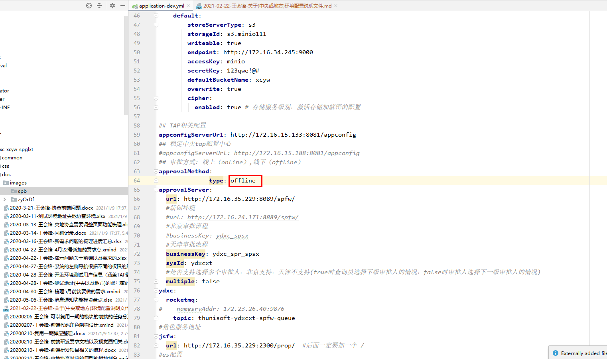
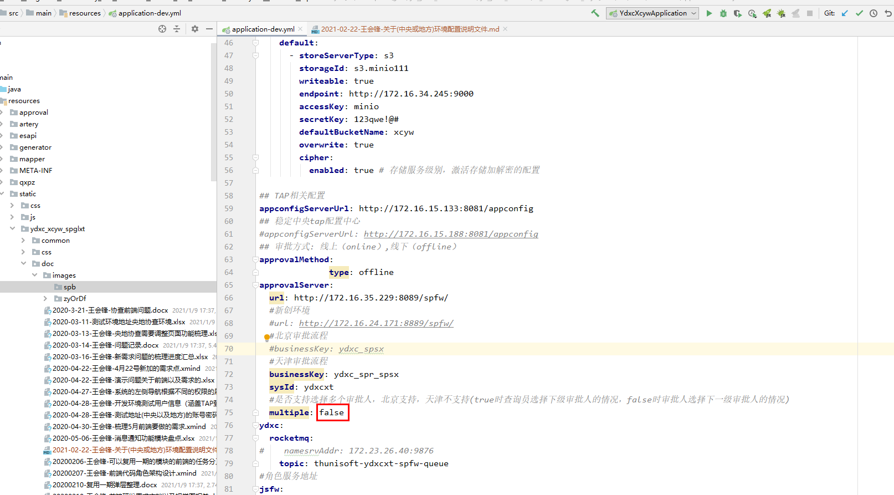

# 审批表(线上审批表或者线下审批表以及审批流转弹层中的组织机构是多选还是单选)（application-dev.yml）

## 注意审批表中的下面的按钮（生成审批表或者提交审批表）
### 线上审批表
####### 审批方式: 线上（online）,线下（offline）
###### 注意下面的图

### 线下审批表
####### 审批方式: 线上（online）,线下（offline）
###### 注意下面的图

### 审批流转
###### 审批流转中的组织机构是多选还是单选，注意下面的图

#######是否支持选择多个审批人，北京支持，天津不支持(true时查询员选择下级审批人的情况，false时审批人选择下一级审批人的情况)
